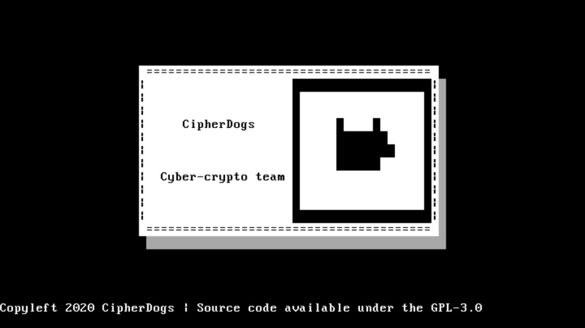

# cipherdogs-os-art
CipherDogs operating system made using Rust



## Dependencies
```sh
sudo apt install qemu
sudo apt install qemu-system-x86
sudo apt install grub-common
sudo apt install xorriso
cargo install cargo-xbuild
cargo install bootimage
rustup component add rust-src
rustup component add llvm-tools-preview
```

## Run

### QEMU
```sh
cargo xrun
```

### Integration testing
```sh
cargo xtest
```
